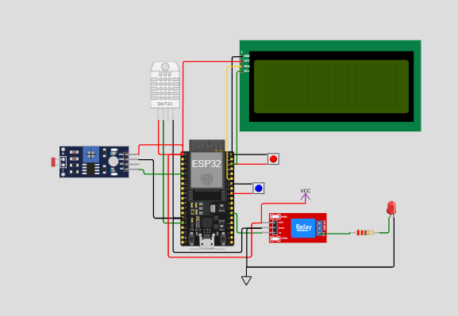

# FIAP - Faculdade de Informática e Administração Paulista 

<p align="center">
  <a href="https://www.fiap.com.br/">
    
  </a>
</p>


<br>

# 🌱 FarmTech Solutions - Sistema de Irrigação Inteligente
## 👨‍🎓 Integrantes: 
- Vitor Eiji Fernandes Teruia
```
- RM: rm563683
- E-mail: vitorfer2018@gmail.com
- GitHub: [@Vitor985-hub](https://github.com/Vitor985-hub)
```
- Beatriz Pilecarte de Melo
```
 - RM: rm564952
 - E-mail: beatrizpilecartedemelo@gmail.com
 - GitHub: [@BPilecarte](https://github.com/BPilecarte)
```
- Francismar Alves Martins Junior
```
 - RM: m562869
 - E-mail: yggdrasil.git@gmail.com
 - GitHub: [@yggdrasilGit](https://github.com/yggdrasilGit
```
- Antônio Ancelmo Neto barros
```
 - RM: rm563683
 - E-mail: antonio.anbarros@gmail.com
 - GitHub: [@AntonioBarros19](https://github.com/AntonioBarros19)
```
- Matheus Soares Bento da Silva
```
 - RM: rm565540
 - E-mail: matheusbento044@gmail.com
 - GitHub: [matheusbento044](https://github.com/matheusbento04)
```

## 👩‍🏫 Professores:
### Tutor(a) 
- <a href="https://www.linkedin.com/in/leonardoorabona/">Leonardo Ruiz Orabona</a>
### Coordenador(a)
- <a href="https://www.linkedin.com/company/inova-fusc">ANDRÉ GODOI CHIOVATO</a>


## 📜 Descrição

Este projeto simula um sistema de irrigação inteligente com sensores físicos implementados na plataforma Wokwi, 
utilizando um microcontrolador ESP32. O sistema coleta dados simulados de umidade do solo, nutrientes (fósforo e potássio) e pH,
controlando uma bomba de irrigação automaticamente e armazenando os dados em um banco de dados SQL via script Python.
Também há funcionalidades extras de visualização via dashboard e integração com dados climáticos reais por meio de uma API pública.

---
## 🔧 Tecnologias Utilizadas

- ESP32 com PlatformIO (VS Code)
- Simulador Wokwi.com
- C/C++ (para o firmware do ESP32)
- Python 3
- SQLite (banco de dados local)
- Bibliotecas Python: `sqlite3`, `matplotlib`, `streamlit`, `requests`
- API Pública: OpenWeather (https://openweathermap.org/api)

---

## 🧠 Lógica do Projeto

### Sensores Simulados

| Sensor       | Componente Simulado | Tipo de Valor    | Descrição                                         |
|--------------|---------------------|------------------|---------------------------------------------------|
| Umidade      | DHT22               | Analógico        | Mede a umidade do solo                            |
| Fósforo (P)  | Botão físico        | Booleano (ON/OFF)| Simula presença/ausência de fósforo               |
| Potássio (K) | Botão físico        | Booleano (ON/OFF)| Simula presença/ausência de potássio              |
| pH           | LDR (sensor de luz) | Analógico        | Representa variação contínua do pH do solo        |

### Atuação

- Um relé é usado para simular a bomba de irrigação.
- O LED embutido no relé indica o status da bomba:
  - 💡 **Ligado** = irrigação ativa
  - ❌ **Desligado** = irrigação inativa
 
## Integração com API Climática

Este projeto utiliza a API pública do [OpenWeather](https://openweathermap.org/api) para obter dados climáticos em tempo real da cidade de São Paulo.

### Como funciona:

- A API retorna informações como temperatura, condição do tempo (ex: "chuva leve") e volume de chuva recente.
- O script em Python analisa esses dados e decide se a irrigação será ativada ou não.
- Lógica utilizada:
  - **Se houver previsão de chuva ou chuva recente**, **não irrigar**.
  - **Se estiver acima de 30 °C e sem chuva**, **irrigar**.
  - **Caso contrário**, irrigar normalmente, desde que não haja chuva.

A integração é feita com a biblioteca `requests`, e a chave da API deve ser obtida gratuitamente no site oficial.

---

## 🧾 Critérios para Acionamento da Bomba

A bomba de irrigação será ligada automaticamente quando:

- A umidade estiver abaixo de um limite mínimo (ex: 40%);
- E houver presença de pelo menos um nutriente (P ou K);
- E o valor de pH estiver dentro de uma faixa considerada ideal (simulado via LDR).

## imagens dos circuitos

### Sensor Solo (principal, utilizado no projeto)


### Sensor de Umidade


### Sensor de Fósforo


### Sensor de pH


### Sensor de Potássio


---


## 📁 Estrutura de pastas
```

```
Abaixo está a estrutura do projeto em formato Markdown:

```markdown
# Estrutura do Projeto: SISTEMA-DE-IRRIGACAO

```markdown
# Estrutura do Projeto: SISTEMA-DE-IRRIGACAO

SISTEMA-DE-IRRIGACAO
│
├── __pycache__/
├── .vscode/
├── assets/
│   ├── imagens_dos_circuitos/
│   └── logo-fiap.png
│
├── connection/
│   ├── __pycache__/
│   ├── __init__.py
│   └── connection_db.py
│
├── controller/
│   ├── __pycache__/
│   ├── __init__.py
│   ├── area_plantio_controller.py
│   ├── cultura_controller.py
│   └── sensor_controller.py
│
├── dashboard/
│   ├── __init__.py
│   └── app.py
│
├── data/
│   └──console_print.json
│
├── model/
│   ├── __pycache__/
│   ├── __init__.py
│   ├── area_plantio_model.py
│   ├── correcao_model.py
│   ├── cultura_model.py
│   ├── leitura_sensor_model.py
│   └── sensor_model.py
│
├── sensor_solo/
│   ├── .vscode/
│   ├── src/
│   ├── .gitignore
│   ├── diagram.json
│   ├── main.py
│   ├── platformio.ini
│   ├── python-installer.exe
│   └── wokwi.toml
│
├── .env
├── .env copy
├── .gitignore
├── api_climatica.py
├── main.ino
├── main.py
├── README.md
└── requirements.txt
```

## ▶️ Como utilizar:

💾 Instalação

1. clone o repositório:
```
https://github.com/Startup-FarmTech-Solutions/Sistema-de-Irrigacao-Inteligente-com-Sensores.git
```
2. Crie e ative um ambiente virtual (opcional, mas recomendado):
```
python -m venv venv
source venv/bin/activate      # Linux/macOS
venv\Scripts\activate         # Windows
```
3. Instale as bibliotecas necessárias:
```
pip install -r requirements.txt
```
4. Localizar o arquivo prog1.ino no diretório sensor_solo/src:

  1. Identificar a variável *server_ip (atualmente na linha 56)

  1. Inserir o número do IP da sua máquina

5. Localizar o arquivo main.py no diretório sensor_solo/:

  1. Identificar o método def main (atualmente na linha 162)

  2. Na variável host inserir IP da sua máquina 

## 🔧 Como executar o código

1. 📟 Simulação no Wokwi
   
   1. Acesse o arquivo driagram.json em sensor_solo/

   2. Inicie a simulação clicando em "Start Simulation"

   3. Observe os dados dos sensores sendo exibidos no display LCD e  no console da simulação (ou simulador serial)


2. 🐍 Execução do Código Python

   1.Acesse o arquivo main.py (na raiz do projeto):

   2.Execute o script principal:
   ```
   python main.py
   ```

.Consulta API climática

3. 📊 Rodar o Dashboard
Se estiver usando uma interface com Streamlit ou Flask:
```
cd ../dashboard
streamlit run app.py
```
Acesse via navegador: http://localhost:8501


## 🗃 Histórico de lançamentos

* 0.1.0 - 14/05/2025
    *
* 0.2.0 - 19/05/2025
## 📋 Licença

<p xmlns:cc="http://creativecommons.org/ns#" xmlns:dct="http://purl.org/dc/terms/"><a property="dct:title" rel="cc:attributionURL" href="https://github.com/agodoi/template">MODELO GIT FIAP</a> por <a rel="cc:attributionURL dct:creator" property="cc:attributionName" href="https://fiap.com.br">Fiap</a> está licenciado sobre <a href="http://creativecommons.org/licenses/by/4.0/?ref=chooser-v1" target="_blank" rel="license noopener noreferrer" style="display:inline-block;">Attribution 4.0 International</a>.</p>

